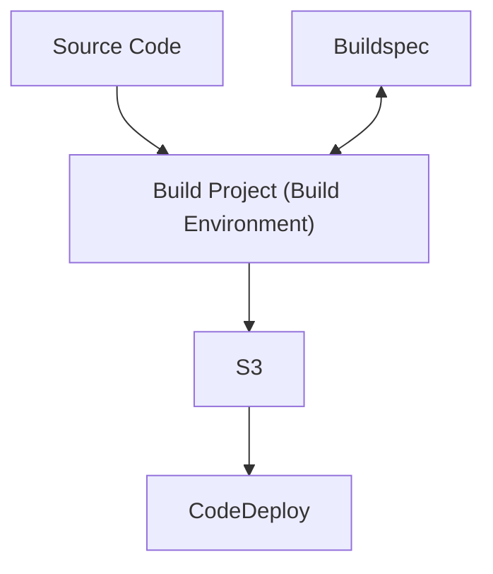

# AWS: Certified DevOps Engineer – Professional (DOP-C02)

## Introduction

### Exam Overview

**Level:** Professional
**Length:** 180 minutes to complete the exam
**Cost:** 300 USD
**Format:** 75 questions, either multiple choice or multiple response
**Delivery method:** Testing center or online proctored exam

### Content Outline

- **Domain 1:** SDLC Automation _(22% of scored content)_
- **Domain 2:** Configuration Management and IaC _(17% of scored content)_
- **Domain 3:** Resilient Cloud Solutions _(15% of scored content)_
- **Domain 4:** Monitoring and Logging _(15% of scored content)_
- **Domain 5:** Incident and Event Response _(14% of scored content)_
- **Domain 6:** Security and Compliance _(17% of scored content)_

## SDLC Automation

### CodeCommit

#### CI/CD Concepts

**What problems are we trying to solve?:**
These types of projects are slow, not iterative and have long release cycles.

**How do we merge the goals of Dev and Ops?:**
The traditional goals of software development and IT operations do not really align.

- **Dev:** _How many changes, features and defects can we push into production and how quickly can we do it?_
- **Ops:** _We want stable and available systems!_

**How can we solve these problems?:**
DevOps. _Shorten dev lifecycle._ Deliver features, fixes and updates frequently.

```
                 +-----------------------+
                 |                       |
+----------------|------+           QA   |
|                |      |                |
|  DEV           |      |                |
|                |      |                |
|                |      |                |
|                |      |                |
|            +---|-------------------+   |
|            |   |      |            |   |
|            |   |DEVOPS|            |   |
|            |   |      |            |   |
|            |   +-----------------------+
|            |          |            |
+------------|----------+            |
             |                       |
             |                       |
             |                       |
             |      OPERATIONS       |
             |                       |
             +-----------------------+
```

**How does DevOps look in action?:**

```
MONITOR --------> PLAN --------> CODE

  ^                                |
  |                                |
  |                                v

OPERATE                          BUILD

  ^                                |
  |                                |
  |                                v

DEPLOY <------- RELEASE <------- TEST
```

**What is CI/CD?:**

- Continuous Integration (CI)
- Continuous Delivery (CD)

**Continuous Delivery or Continuous Deployment? Are they the same thing?:**
No, they are not the same thing.

```
+----------+      +----------+      +----------+      +----------+      +----------+
|          |      |          |      |          |      |          |      |          |
|          |      |          |      |          |      |          |      |          |
|  SOURCE  | ---> |   TEST   | ---> |  BUILD   | ---> |    QA    | ---> | RELEASE  |
|   CODE   |      |          |      |          |      |          |      |          |
|          |      |          |      |          |      |          |      |          |
|          |      |          |      |          |      |          |      |          |
+----------+      +----------+      +----------+      +----------+      +----------+

           CONTINUOUS INTEGRATION
----------------------------------------------->

                                      CONTINUOUS DELIVERY    +----+      DEPLOY
                                    -----------------------> |STOP| --------------->
                                                             +----+


                                                  CONTINUOUS DEPLOYMENT
                                    ----------------------------------------------->
```

**Continuous Deployment:** An update is automated the whole way out to production _without the safeguards of continuous devivery_.
**Continuous Delivery:** Focuses on safely getting changes out to production. _Key point: there is a stop for approval before going to production_.

**Developer Tools on AWS**

- **CodeCommit:** For our repository
- **CodeBuild:** For our build
- **CodeDeploy:** For our deployment
- **CodePipeline:** Automate and manage the above services

##### Key Points

- **Continuous Deployment:** An update is automated the whole way out to production _without the safeguards of Continuous Delivery_.
- **Continuous Delivery:** Focuses on safely getting changes out to production. _Key point: there is a stop for approval before going to production_.

#### CodeCommit Overview

##### Key Points

> NOTE: Amazon has announced that CodeCommit is being deprecated [(read announcement)][codecommit-deprecation]. Whilst that renders this entire section redundant, it is still worth understanding the concepts as in a lot of cases, the CodeCommit repo can simply be swapped out with another third party git host.

**What is CodeCommit?:**
It is a _managed service_ that hosts private Git repositories.

**Why not just use Git?:**
Well, you can. But the key term is _managed service_.

##### Benefits

- Highly available, scalable and fault tolerant
- No size limit
- Integrates with other AWS services (CodeBuild, CodePipeline, CodeDeploy, Lambda, SNS)
- Works with existing Git-based tools

##### Exam Tips

- CodeCommit has many benefits but _is not the only repository_ you can use in an AWS deployment pipeline.
- When in CodeCommit (or CodeBuild and CodeDeploy) in the AWS Management Console, _study the dropdowns_.
- Other repositories that can be used in AWS deployments include _S3_, _GitHub_, _Bitbucket_ and _GitHub Enterprise_.

[codecommit-deprecation]: https://aws.amazon.com/blogs/devops/how-to-migrate-your-aws-codecommit-repository-to-another-git-provider/

#### CodeCommit Repository Actions

##### AWS CLI Command Review

The following AWS CLI commands can be used to interact with CodeCommit repositories

- List Repositories: `aws codecommit list-repositories`
- Create Repository: `aws codecommit create-repository --repository-name SomeRepoName`
- Get (View) Repository: `aws codecommit get-repository --repository-name SomeRepoName`
- Delete Repository: `aws codecommit delete-repository --repository-name SomeRepoName`

##### Exam Tips

- If asked to select the proper command, note that the majority of these commands are very literal.

#### CodeCommit Cloning, Commit, Pushes and Pulls

##### Exam Tips

- **Commit:** Understand that commit is committing changes to your local repository. _To get these changes to the main repository, you need to do a push._
- **Order of Operations:**
  - _Make_ changes to local files.
  - _Commit_ changes to your local repo.
  - _Push_ changes to a remote repo.

#### CodeCommit Merging and Branching

- **What's the problem?:** Our developers are making changes in the same file to the same lines of code. _This cuases a conflict and needs to be sorted out._
- **What's the solution?:** _The merge process_ will help to resolve these conflicts and keep our code and our team on the same page.
- **What are Branches?:** An independant line of development. They allow us to safely make changes to code without disrupting the code on the main branch.
- **Why Branches?:**
  - To build a new feature
  - To fix bugs
  - Without disrupting the main branch

##### Exam Tips

- Three things to remember when it comes to Branches
  - Separate work
  - Work on new features
  - Create a bug fix branch

#### CodeCommit Data Security

**Use CodeCommit when you need:**

- Data encrypted in transit and at rest
- Managed service AWS secures
- Highly available and scalable

**Data Security Scenario**
Q: You want your development team to have full access to CodeCommit, but they should not be able to create or delete repositories.
A: Attach the AWSCodeCommit PowerUser policy to the account of each developer. Or better yet, create an IAM group to manage the developers in one place and attach that policy to the group.

##### Exam Tips

- **CodeCommit Tip:** Repositories are automatically _encrypted at rest_.
- **Repositories Tip:** Repositories _are also encrypted in transit_ using either HTTPS, SSH or both (configurable at setup).

#### CodeCommit Advanced

**Migrating a Git Repository to CodeCommit**

```
                                                               (We have a
                                                               Github Repo)
                        Local Dev           CodeCommit             Git
                            .                   .                   .
                            |                   |                   |
          Create CodeCommit |                   |                   |
          repository        +------------------>|                   |
                            |                   |                   |
                            |                   |                   |
                            |                   |                   |
  Git client: Clone Project |<------------------+------------------>|
                            |                   |                   |
                            |                   |                   |
                            |                   |                   |
Git Client: Push project to +------------------>|                   |
new CodeCommit repository   |                   |                   |
                            |                   |                   |
                            .                   .                   .
```

**Securing Repositories and Branches**

- **Use Case:** By default, any CodeCommit repository user who has sufficient permissions to push code to the repository can contribute to any branch in that repository. This has caused some problems and we need to limit pushes to prod to our Admins.
- **Solution:** We can create an IAM policy (or a group with a policy attached) that allows only certain users to push to the prod branch.

**Replicating Repositories Between Regions**

```
Q: How can we replicate a CodeCommit Repository across regions?

A: Create a trust, a service role that allows us to work in region 2.
   You could set up a step in your pipeline triggers a Lambda that
   executes a `git:push` to the repository in the other region.

   +-----------------------------------------------------+                        +----------------+
   |Region 1                                             |                        |Region 2        |
   |                                                     |                        |                |
   |                                                     |                        |                |
   |                                                     |                        |                |
   | +------------+    +-----------+    +--------------+ |                        | +------------+ |
   | |            |    |           |    |              | |                        | |            | |
   | | CodeCommit |    | CodeBuild |    | CodePipeline | | ---------------------> | | CodeCommit | |
   | |            |    |           |    |              | |     +------------+     | |            | |
   | +------------+    +-----------+    +--------------+ |     | CodeBuild  |     | +------------+ |
   |                                                     |     |Service Role|     |                |
   |                   +-----------+                     |     |  git:push  |     |                |
   |                   | buildspec |                     |     +------------+     |                |
   |                   +-----------+                     |                        |                |
   |                                                     |                        |                |
   +-----------------------------------------------------+                        +----------------+
```

**Key Repository Steps**

1. Migrate a Git repository to CodeCommit
2. Branch the repository
3. Limit who can push to the `prod` repository with an IAM policy
4. Set up a pipeline to replicate our repository across regions

### CodeBuild

#### Introduction to CodeBuild

**What is CodeBuild?**

**Fully managed** continuous integration service that compiles source code, runs tests and produces software packages that are ready to deploy.

**How do we access CodeBuild?**

- Management console
- CLI
- SDK
- CodePipeline

```
    SOURCE               BUILD
+------------+       +-----------+
|            |       |           | - Fully managed
|            |       |           | - No need to provision /
| CodeCommit +------>| CodeBuild |   scale servers
|            |       |           | - Prepackaged build
|            |       |           |   environments
+------------+       +-----+-----+
                           |
                           |
                           v
                        +------+
                        |      | - Versioning
                        |  S3  | - Encryption
                        |      |
                        +------+
                        ARTIFACT
```

##### Exam Tips

- **How can CodeBuild be used?:**
  - It can be added to the _build stage_ and also the test stage _in a pipeline_.
  - You must provide CodeBuild _with a build project_.
- **What is a build project?:**
  - _A build project includes_ information about how to run a build, including where to get the source code, which build environment to use, which build commands to run, and where to store the build output.

#### CodeBuild Walkthrough

##### Steps

1. Provide CodeBuild with a _Build Project_. This will tell CodeBuild how to perform the build itself (where to get the source, what environments to use, what commands to use, where to store the build output etc.).
2. CodeBuild uses the _Build Project_ to create the _Build Environment_.
3. _Source Code_ is downloaded into the _Build Environment_ and uses the _Build Specification_ (Buildspec) file. The Buildspec is a collection of build commands and related settings that CodeBuild uses to run a build.
4. CodeBuild sends the output of a build to our output repository (usually S3). We can also set up notifications and have an SNS topic that gets updated when a new build output is put onto the S3 bucket.
5. Build runs. Information can be send to CloudWatch and also back to CodeBuild regarding the status of the build.
6. Build can be monitored with the tool of our choice (Management Console, CLI, SDK etc.).

Remember, the _input_ is the _Source Code_ (which in turn could be considered the _output_ of the _Source_ step in the pipeline), and _outputs_ (the artifacts generated by the build process) are usually sent to S3 and become the _input_ for the next step (likely CodeDeploy, but other build systems can be used).

**NOTE:** As input, you must provide CodeBuild with a build project.

##### Use Cases

**Ask yourself:**

_Do you need to run CodeBuild after a successful merge to CodeCommit?_

Set up CloudWatch to monitor for merges to CodeCommit and then trigger a build in CodeBuild.

```
   +-----+
   | DEV |
   +--+--+
      |
      |
      v
+------------+
| CodeCommit |<-----+
+------------+      |
                    |
                    |
            +-------+------+
            |  CloudWatch  |
            | /EventBridge |
            |    Events    |
            +-------+------+
                    |
                    |
 +-----------+      |
 | CodeBuild |<-----+
 +-----------+
```

**You're given a new requirement:**

_You need to review CodeBuild logs and notify personnel of new logs._

- _Send CodeBuild logs to_ to CloudWatch Logs.
- _Set up a CloudWatch Event_ to monitor for new logs.
- _Trigger a Lambda function_ to send a notification to Slack.

**NOTE:** CloudWatch Events has recently been rebranded to EventBridge Events

```
 +-----------+       +------------+
 | CodeBuild +------>| CloudWatch |
 +-----------+       |    Logs    |
                     +------------+


+--------------+
|  CloudWatch  |       +--------+       +-------+
| /EventBridge +------>| Lambda +------>| Slack |
|    Events    |       +--------+       +-------+
+--------------+
```

- **Input**: You must provide CodeBuild _with a build project_.
- **Output**: If there is any build output (artifacts), the build environment _uploads its output to an S3 bucket_.

##### Exam Tips

- Do you need a _build stage_?:
  - Only if your code artifacts need to be built/packaged. (e.g. For Java, you build a JAR file; whereas simple HTML does not need to be built.)
- What is a _buildspec_?:
  - _A collection of build commands and related settings_, in YAML format, the CodeBuild uses to run a build.

#### Working with Build Projects and the Buildspec File

##### Orchestrating Builds Using the Buildspec File



##### Steps in a Build Project

1. Submitted
2. Provisioning (build servers)
3. Download Source
4. Install
5. Pre-Build
6. Build
7. Post-Build
8. Upload Artifacts
9. Finalising
10. Completing

##### Let's Talk Buildspec

**What is a Buildspec?**

A buildspec is a **collection of build commands and related settings**, in YAML format, that CodeBuild uses to run a build.

**How does a buildspec file work with the build environment?**

You can include a buildspec as part of the **source code or you can define a buildspec** when you create a build project.

**What benefits are there to using a buildspec file?**

**Without a buildspec**, CodeBuild cannot successfully convert your build input into build output or locate the build output artifact in the build environment to upload to your output bucket.

**NOTE:** **If you include a buildspec as part of the output, by default,** the buildspec file must be named `buildspec.yml` and placed in the root of your source directory.

**NOTE:** **You can specify only 1 buildspec** for a build project, regardless of the buildspec file's name.

##### Example Buildspec File

```yaml
version: 0.2

phases:
  install:
    runtime-versions:
      nodejs: 10
    commands:
      - echo Installing app dependencies...
      - yarn install
  build:
    commands:
      - echo Building static site...
      - yarn build
      - echo Run tests...
      - CI=true yarn test

artifacts:
  type: zip
  paths:
    - './build/**/*'
    - './cicd/**/*'

cache:
  paths:
    - './node_modules/**/*'
```

##### Exam Tips

Here are some questions to ask when it comes to **planning a build**.

- Where's the source code?
- Which build commands and in what order?
- Which runtimes and tools are needed?
- Is a service role needed to work with other AWS services?
- Is CodeBuild working with your VPC?
  - What do you need?
    - VPC ID
    - Security groups
    - Subnet IDs

#### CodeBuild Advanced

##### Running CodeBuild Locally

You don't need LocalStack to run CodeBuild locally (e.g. for testing a complex buildspec); It would actually be overkill. Instead use the **CodeBuild Agent**.

**Benefits**

- Test the `buildspec.yml` before actually using it in AWS CodeBuild projects.
- Test and build applications locally before committing the changes.
- Identify, fix, and experiment with things quickly.

###### Steps

1. Install `git` on your local machine.
2. Install and set up Docker on your local machine.
3. Set up the build image - you can pull it from the CodeBuild public Amazon ECR repository.
4. Download the CodeBuild Agent.
5. Run the CodeBuild Agent.

##### CodeBuild with VPC

**Use Cases**

Run integration tests from your build against data in an Amazon RDS database that's isolated on a private subnet.

Query data in an Amazon ElastiCache cluster directly from tests.

Interact with internal web services hosted on Amazon EC2, Amazon ECS, or services that use internal Elastic Load Balancing.

##### CodeBuild Environment Variables

AWS CodeBuild provides several environment variables that you can use in your build commands:

- `AWS_DEFAULT_REGION` (for CLI)
- `AWS_REGION` (for SDK)
- `CODEBUILD_BATCH_BUILD_IDENTIFIER`
- `CODEBUILD_BUILD_ARN`

**Can we store the Access Key in these variables?**

**This should not be used for sensitive data.** You can use Parameter Store or Secrets Manager for that kind of data.

##### Automated Code Review on Pull Requests

1. Developer raises a pull request against the `main` branch of the source code repository.
2. The pull requests event is received by the default event bus.
3. The default event bus triggers the EventBridge rule.
4. The EventBridge rule triggers the CodeBuild project.
5. The AWS CodeBuild project runs the code quality check and sends the results back to the pull request as comments. The AWS CodeBuild project approves or rejects the pull request automatically.
